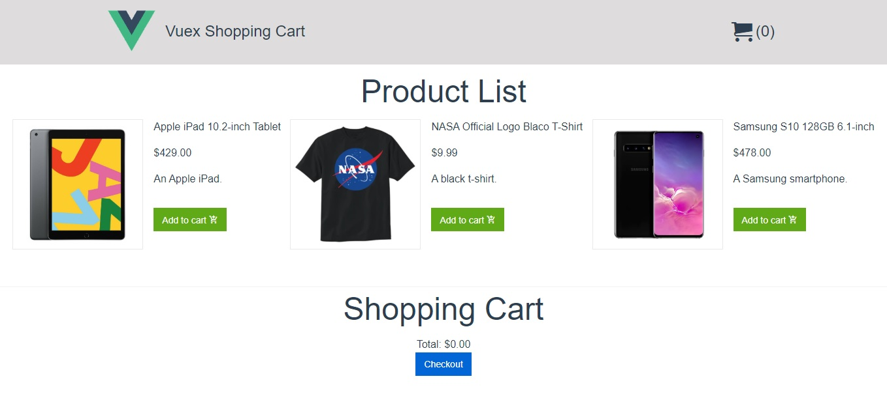
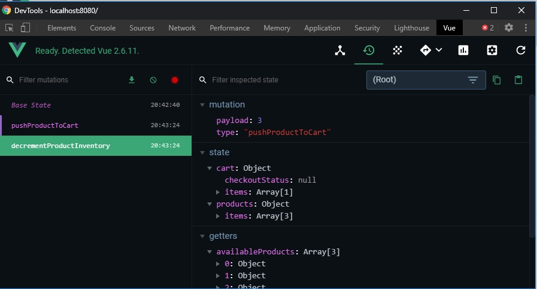

# # Vuex-Shopping-Cart

A project to practice/learn Vuex, it simulates a very basic shopping page with some products and actions to add to cart and purchase.  

  

## Getting Started

These instructions will get you a copy of the project up and running on your local machine for development and testing purposes.

### Prerequisites

You will need:  
* To have installed a package manager, for example: [npm](https://www.npmjs.com/) or [yarn](https://www.yarnpkg.com);  
* And a code editor, like [VScode](https://code.visualstudio.com) or [Sublime](https://sublimetext.com);

### Installing

Example using yarn:  

* Download or clone this project;  
* Open your favorite code editor and run `yarn install`;  
* Run `yarn run dev` and that is it!

The project is using [Metro4](https://metroui.org.ua/), if yarn didn't install it, you can get the instructions to do so [here](https://metroui.org.ua/vuejs.html).  

## Built With

* [Vue](https://vuejs.org/) - The web framework
* [Vuex](https://vuex.vuejs.org/) - State management library
* [Metro4](https://metroui.org.ua/) - CSS component library
* [Webpack-Template](https://github.com/vuejs/vuex/tree/dev/examples/shopping-cart) - Template used to start the project
* [API mock](https://github.com/vuejs/vuex/tree/dev/examples/shopping-cart/api) - API mock file used to simulate the store's database and the purchase action

## Extra  

While developing a VueJS app, it might be useful to have installed in your browser the Vue Devtools extension.  
It's a extension for debugging VueJS applications available for Chrome and Firefox.

  

Vue DevTools for [Chrome](https://chrome.google.com/webstore/detail/vuejs-devtools/nhdogjmejiglipccpnnnanhbledajbpd?hl=en)  
Vue DevTools for [Firefox](https://addons.mozilla.org/en-US/firefox/addon/vue-js-devtools/)

To know more about Vue CLI, check this [link](https://br.vuejs.org/v2/guide/installation.html#CLI)

For better understanding how this project works, the links bellow will be very useful:  

[Vuex for everyone](https://vueschool.io/courses/vuex-for-everyone) - The initial project was built following this tutorial.  
[What is Vuex?](https://vuex.vuejs.org/) - Vuex documentation  
Vuex on [Github](https://github.com/vuejs/vuex)